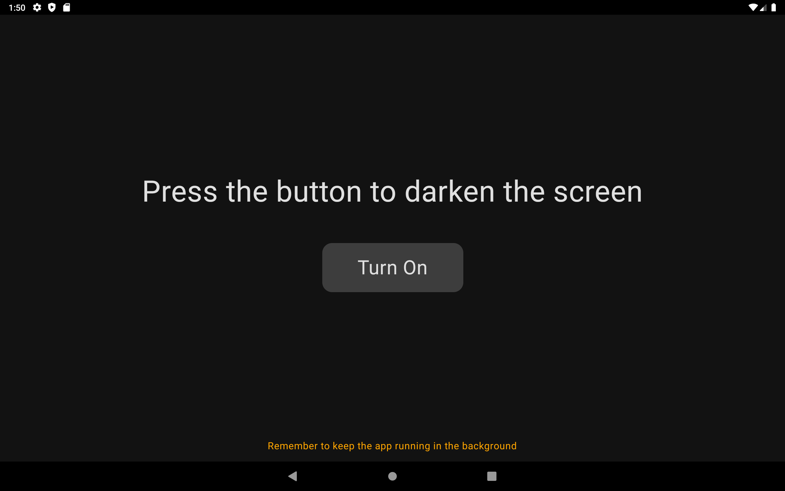
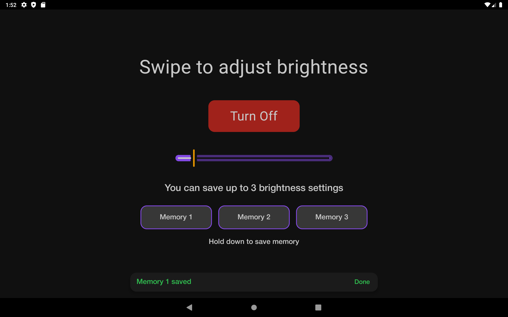
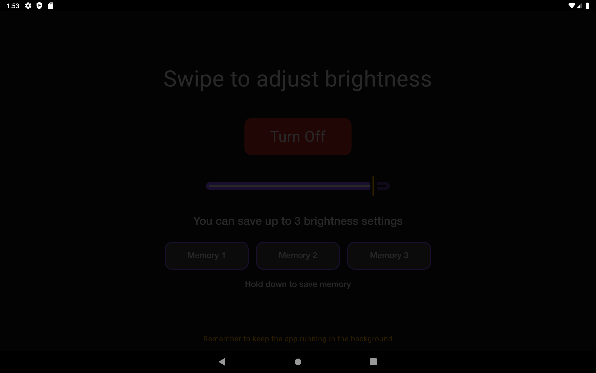
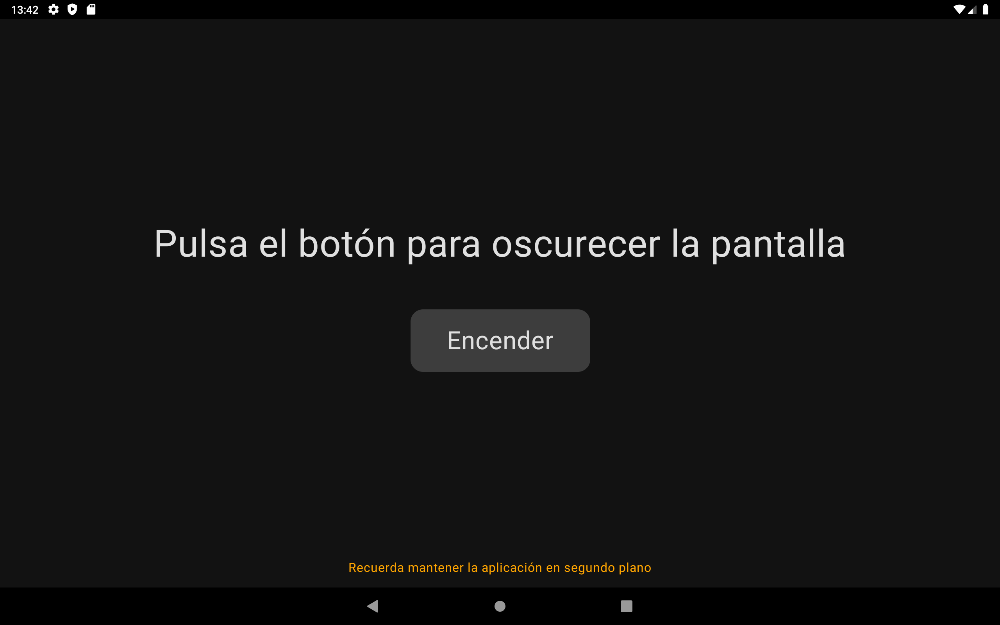
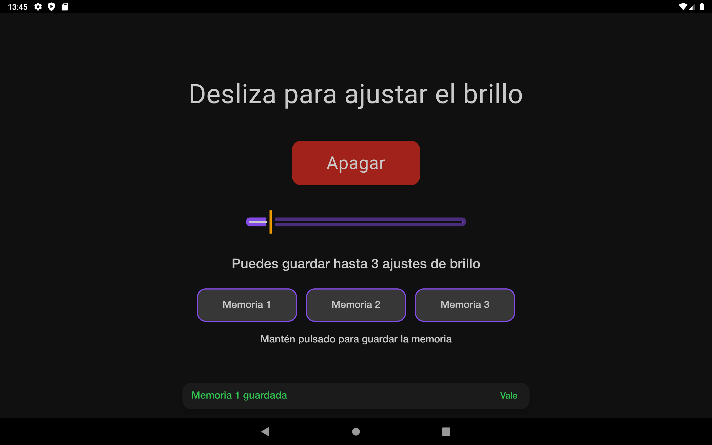
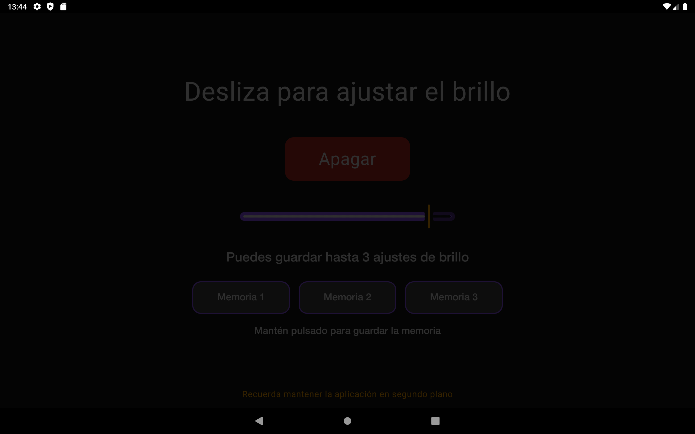

# DarkMode+ (DarkModePlus) - English Version

DarkMode+ is an Android application designed primarily for Chinese car radios. It allows users to reduce screen brightness beyond the system's default minimum. The app applies a dark overlay that can be adjusted via a slider, helping to minimize glare during nighttime driving.

## Features
- Applies a dark filter over the screen to reduce brightness.
- Adjustable opacity via a slider.
- Three configurable memory slots stored using **SharedPreferences** for different brightness levels.
- Simple and lightweight interface developed with **Kotlin** and **Jetpack Compose**.
- Available in **English and Spanish**.

## Technologies Used
- **Language:** Kotlin
- **UI Framework:** Jetpack Compose
- **Settings Storage:** SharedPreferences

## Installation
1. Download the APK from [Download APK](APK/DarkModePlus-2-1.1.apk).
2. Install the application on your Android device.
3. Grant the necessary permissions to allow the app to overlay the screen.
4. Adjust the opacity level according to your preference.
5. Remember to keep the application in the background, exiting with the home icon, not the back button.

## Screenshots

## Contribution
If you would like to improve the app or report issues, you can do so via issues or pull requests in this repository.

## License
This project is distributed under the [MIT](LICENSE) license.

---

# DarkMode+ (DarkModePlus)

DarkMode+ es una aplicación diseñada para dispositivos Android, especialmente radios de coche chinas, que permite reducir el brillo de la pantalla más allá del mínimo estándar del sistema. Utiliza un filtro de opacidad ajustable mediante un slider, lo que ayuda a reducir el deslumbramiento durante la conducción nocturna.

## Características
- Aplicación de un filtro oscuro sobre la pantalla para reducir el brillo.
- Ajuste de opacidad mediante un control deslizante.
- Tres memorias configurables mediante **SharedPreferences** para almacenar diferentes niveles de opacidad.
- Interfaz simple y ligera, desarrollada con **Kotlin** y **Jetpack Compose**.
- Disponible en **inglés y español**.

## Tecnologías utilizadas
- **Lenguaje:** Kotlin
- **UI Framework:** Jetpack Compose
- **Almacenamiento de configuraciones:** SharedPreferences

## Instalación
1. Descarga el APK desde [Descargar APK](APK/DarkModePlus-2-1.1.apk).
2. Instala la aplicación en tu dispositivo Android.
3. Concede los permisos necesarios para que la app pueda superponer la pantalla.
4. Ajusta el nivel de opacidad según tu preferencia.
5. Recuerda mantener la aplicación en segundo plano, saliendo con el icono de home, no con el botón de atrás.

## Capturas de pantalla

## Contribución
Si deseas mejorar la aplicación o reportar errores, puedes hacerlo mediante issues o pull requests en este repositorio.

## Licencia
Este proyecto se distribuye bajo la licencia [MIT](LICENSE).

